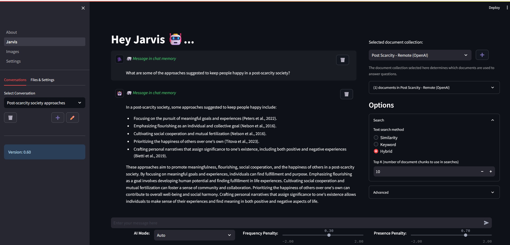

# AI Assistant (Jarvis)
An intelligent assistant.  This is a work in progress.  Don't hate over the name... I was younger, and less creative.

### Features
- ✅ Chat with the AI (Conversation Mode)
- ✅ Get the News
- ✅ Get the Weather
- ✅ Upload your Documents, and talk about them with the AI, including:
    - ✅ Search for information
    - ✅ Summarize a topic or whole documents
    - ✅ Perform multi-hop queries, such as "What is the capital of the country that has the highest population in Europe?"
- ✅ Code Understanding
    - ✅ Code Summarization
    - ✅ Code Review
    - ✅ Code Documentation
    - ✅ Unit Test Generation



- *AI Framework Using [LangChain](https://www.langchain.com/)*
- *UI Framework Using [Streamlit](https://streamlit.io/)*
- *Local models running using [llama.cpp](https://github.com/ggerganov/llama.cpp) via [llama-cpp-python](https://github.com/abetlen/llama-cpp-python)*

# Running Jarvis in Docker
In order to install the assistant using Docker, you'll need the following:

## Pre-requisites for running in Docker 
- Docker ([Docker Desktop](https://www.docker.com/products/docker-desktop/) is what I use) installed and running on your computer
- Git (Optional- you can just grab the [docker-compose.yml](docker-compose.yml) and [.env.template](.env.template) from the GitHub UI here)
- An OpenAI Account and API key (or local models)

The steps to run the docker version is as follows:

# Running Jarvis
1. Get the files
   - Clone the assistant repo: `git clone https://github.com/aronweiler/assistant.git`
   - OR download the [docker-compose.yml](docker-compose.yml) and [.env.template](.env.template) files
2. Edit the `.env.template` file, changing the following items:
   - `OPENAI_API_KEY` - This is your Open AI API key (required for interacting with OpenAI models- the primary model for this application).
   - `POSTGRES_`* entries can be pretty much anything you want, all of this will be local to your machine.
   - `USER_EMAIL` - Put your email in here (required for a user on the system- some features will use this)
   - `SOURCE_CONTROL_PROVIDER` - This is the provider you want to use if you are code reviewing files from URLs.  Can be either `GitHub` or `GitLab`
   - `SOURCE_CONTROL_URL` - Currently this only supports github or gitlab (`https://gitlab.com` or `https://github.com`)
   - `SOURCE_CONTROL_PAT` - This is a personal access token that is used to authenticate with the chosen source code provider, if you're using one.
3. Rename the `.env.template` to `.env`
4. Using a command line, navigate to the directory where you cloned the code, and run `docker-compose up -d`
5. Browse to http://localhost:8500

## Updating Jarvis (Docker)

*🥳 Following these update instructions **WILL NOT ERASE YOUR DATA** 🥳*
 
Run the following commands in a terminal window in the same directory as the Jarvis `docker-compose.yml`:
- `docker-compose down assistant-ui`
- `docker pull aronweiler/assistant:latest` 
  - Alternatively, you can use the version number in place of `latest`, e.g. `docker pull aronweiler/assistant:0.45`
- `docker-compose up -d assistant-ui`
- Navigate to http://localhost:8500
  
*Note: After updating you will need to re-enable/disable any tools that you previously changed on the Settings page.*


## ⚠️ DATABASE CONTAINER WARNING ⚠️
The docker container that has the database in it is currently used primarily by me for development, so it does **not** mount a volume for the database.  
When you delete the DB docker container, **ALL OF YOUR DATA WILL BE ERASED**.

Feel free to alter this behavior on your instance, if you like.

---
Here's a lot of info on running this in Python!

*Note: This is probably out of date, as I don't really support anyone looking at my gross code 🤣*

# Python Prerequisites

## 1. Install the python requirements:

`pip install -r requirements.txt`

### Install Whisper and Torch (for Voice Interactions)
I'm using their github, but feel free to use the python packages.

`pip install --upgrade --no-deps --force-reinstall git+https://github.com/openai/whisper.git`

`pip3 install --force-reinstall --pre torch torchvision torchaudio --index-url https://download.pytorch.org/whl/nightly/cu121`

## 2. Set up the database
*The database is required for conversations, file upload, user management, etc.*

### Database-related Environment Variables

Set the following environment variables for database access:

```
POSTGRES_DB=<your desired database name>
POSTGRES_USER=<user>
POSTGRES_PASSWORD=<password>
POSTGRES_HOST=<database location>
POSTGRES_PORT=5432
```

*Note: When setting the database up, the create/migration scripts have their own settings - so you may need to adjust these.*

### - Run the PGVector (postgres) docker image:

Pull and run the PGVector docker file, following instructions here: [PGVector GitHub](https://github.com/pgvector/pgvector/tree/master#docker)

You can also run my docker-compose file via `docker-compose up -d` from the database folder.

### - Create the database
After creating and running the database docker image, you need to create the actual database.

Run the [create_database.py](src\db\database\create_database.py) python script.

This creates the database...  but for some reason the vector extension is not create.

Connect to the new database, and run: `CREATE EXTENSION IF NOT EXISTS vector;`

### - Set up database migrations:
Migrations make it easy to add/change/remove things from the database when you already have data in there. 

#### - Alembic for migrations setup:
To use Alembic for migrations, you'll need to set up a directory structure for Alembic to manage the migrations. First, create a directory named migrations in your project root. Then, initialize Alembic inside this directory:

``` bash
alembic init migrations
```
This will create an alembic.ini file and a versions directory inside the migrations directory.  The versions directory is required, but the alembic.ini is not!

#### - Running migrations:
1. Run [generate_migration.py](generate_migration.py)
   - This will generate the migrations that contain the changes (or just the initial database) between the current DB and any modifications that have been made to the DB models in code.
2. Run [run_migration.py](run_migration.py)
   - This will push those changes to the database, safely migrating your data.

### More info on the database
See [Memory](src\db\readme.md)