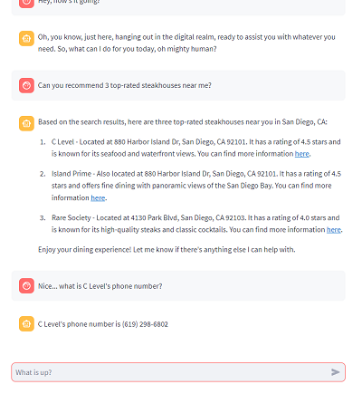

# AI Assistant
An intelligent assistant.  This is a work in progress.

### Features
- ✅ AI Framework Using [LangChain](https://www.langchain.com/)
- ✅ Configuration Framework
- ✅ Console Runner (Run the LLM in a console window)
- ✅ Streamlit UI Runner (Run the LLM in a Web-UI)
- ✅ OpenAI LLM Integration
- ✅ Local LLM Integration (Llama 2- *Note: Some features may not work here yet*)
- ✅ Interaction Management (Conversations, Memory, Files, etc.)
- ✅ Chat with Documents (Upload documents on the Streamlit UI)
- ✅ Postgres Conversation / File Storage
- ✅ Voice Runner (For interactions via voice- back burner for now)

## TODO:
- ☑️ Google API Integration
- ☑️ Generic Tooling (a.k.a. on-demand tools)
- ☑️ API Discovery and Calling

# Running the UI in Docker
All you really need to run this in docker is the [docker-compose.yml](docker-compose.yml), and a [.env](.env.template) (with the values filled in) in some directory on a computer with Docker.

Then, just run `docker-compose up -d` and let docker work it's magic.  

After you've done that, just navigate to [http://localhost:8500](http://localhost:8500) and you're off!

---
Here's a lot of info on running this in Python!

# Python Prerequisits

## 1. Install the python requirements:

`pip install -r requirements.txt`

### Install Whisper and Torch (for Voice Interactions)
I'm using their github, but feel free to use the python packages.

`pip install --upgrade --no-deps --force-reinstall git+https://github.com/openai/whisper.git`

`pip3 install --force-reinstall --pre torch torchvision torchaudio --index-url https://download.pytorch.org/whl/nightly/cu121`

## 2. Set up the database
*The database is required for conversations, file upload, user management, etc.*

### Databse-related Environment Variables

Set the following environment variables for database access:

```
POSTGRES_DB=<your desired database name>
POSTGRES_USER=<user>
POSTGRES_PASSWORD=<password>
POSTGRES_HOST=<database location>
POSTGRES_PORT=5432
```

*Note: When setting the database up, the create/migration scripts have their own settings - so you may need to adjust these.*

### - Run the PGVector (postgres) docker image:

Pull and run the PGVector docker file, following instructions here: [PGVector GitHub](https://github.com/pgvector/pgvector/tree/master#docker)

You can also run my docker-compose file via `docker-compose up -d` from the database folder.

### - Create the database
After creating and running the database docker image, you need to create the actual database.

Run the [create_database.py](src\db\database\create_database.py) python script.

This creates the database...  but for some reason the vector extension is not create.

Connect to the new database, and run: `CREATE EXTENSION IF NOT EXISTS vector;`

### - Set up database migrations:
Migrations make it easy to add/change/remove things from the database when you already have data in there. 

#### - Alembic for migrations setup:
To use Alembic for migrations, you'll need to set up a directory structure for Alembic to manage the migrations. First, create a directory named migrations in your project root. Then, initialize Alembic inside this directory:

``` bash
alembic init migrations
```
This will create an alembic.ini file and a versions directory inside the migrations directory.  The versions directory is required, but the alembic.ini is not!

#### - Running migrations:
1. Run [generate_migration.py](generate_migration.py)
   - This will generate the migrations that contain the changes (or just the initial database) between the current DB and any modifications that have been made to the DB models in code.
2. Run [run_migration.py](run_migration.py)
   - This will push those changes to the database, safely migrating your data.

### More info on the database
See [Memory](src\db\readme.md)

## 3. Configure the assistant
Currently, only the [console_ai_assistant](configurations\console_configs\console_ai_assistant.json) is supported.  Take a look at that configuration file to get a flavor for what future implementations will look like.

Modify the [console_ai_assistant](configurations\console_configs\console_ai_assistant.json) to suit your needs.

# Running the Assistant

## 4. Run the Console or Voice Assistant
Run the run.py file, with your choice of configuration.

**Example:**
`python run.py --config=configurations/console_configs/openai_config.json --logging_level=INFO`

This will allow you to interact with the AI assistant through the console.  

## Run the Streamlit UI Assistant
This is a chat bot interface that has memory, tools, and other fun stuff. 



You need to set the `ASSISTANT_CONFIG_PATH` environment variable before running this command.  See the [launch.json](.vscode/launch.json) file for examples.

Run the [streamlit_ui.py](src/runners/ui/streamlit_ui.py) file with `streamlit`

Use any config that has an `ai` section, such as: `configurations/console_configs/openai_config.json`*
